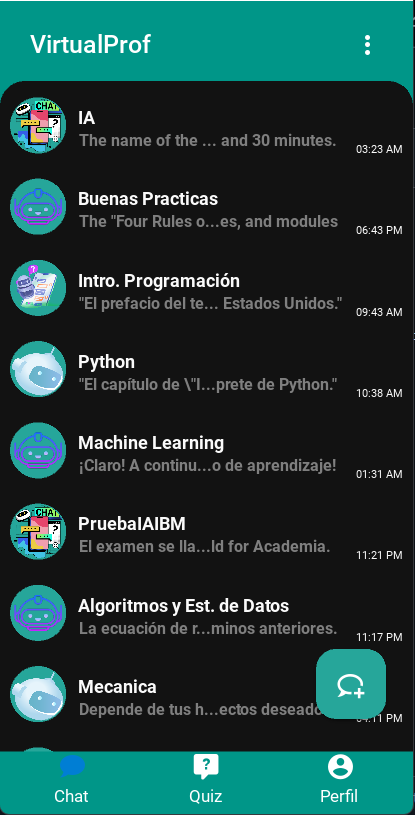
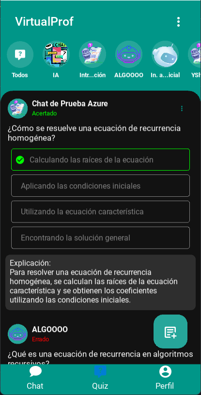
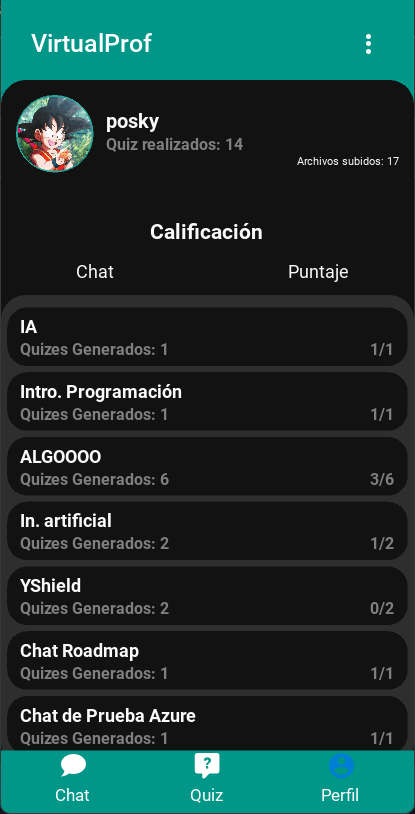
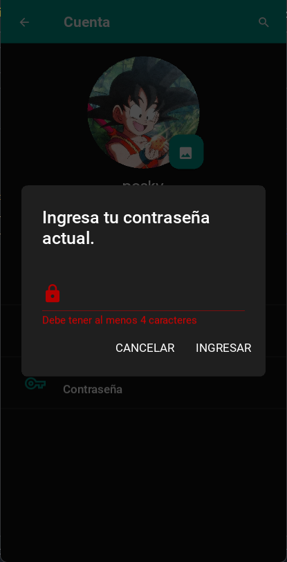
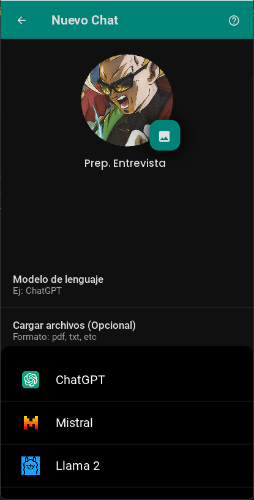
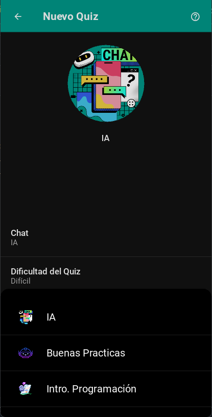
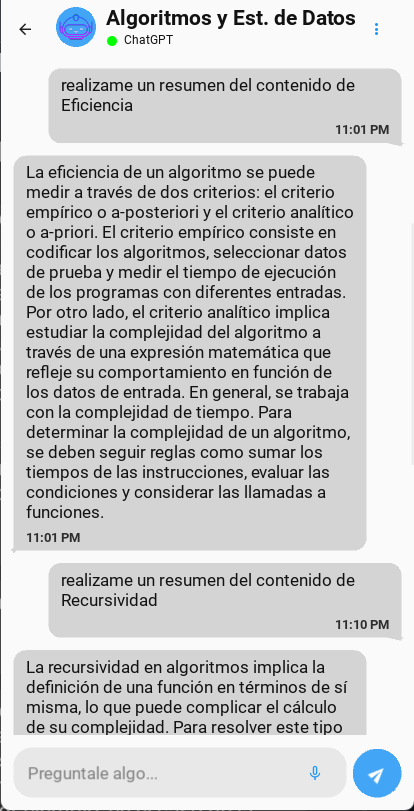

📱 VirtualProf / Proyecto de Título - App Móvil con IA para Lectura de PDF y Generación de Quizzes

Esta aplicación móvil permite a los usuarios cargar documentos PDF, realizar preguntas sobre su contenido y generar quizzes personalizados a partir de las conversaciones, todo dentro de una interfaz intuitiva y fácil de usar.

## 🚀 Tecnologías Destacadas

### 🔧 Frontend (App)
- **Python + Kivy / KivyMD**: Framework para desarrollo de aplicaciones móviles con interfaz gráfica.
- **SQLite**: Base de datos local para persistencia de datos de usuario y estadísticas.

### 🌐 Backend (API)
- **FastAPI**: Framework rápido y moderno para construir APIs en Python.
- **LangChain**: Framework de integración para modelos de lenguaje, permite análisis de PDF y generación de respuestas.
- **OpenAI / Groq / Mistral**: Modelos LLM usados para responder preguntas, generar quizzes y mantener conversaciones inteligentes.
- **ChromaDB**: Base vectorial para recuperación semántica de contexto desde PDFs.
- **Azure Container Instance**: Para desplegar la API en la nube.

---

## ✨ Funcionalidades Principales

- Registro e inicio de sesión de usuarios.
- Carga de archivos PDF para análisis.
- Generación de conversaciones tipo chat con modelos LLM.
- Creación de quizzes personalizados desde los chats.
- Estadísticas de rendimiento.
- Modo claro/oscuro.
- Selección de modelo de lenguaje para cada conversación.

---

## 📷 Capturas de Pantalla

### 🧭 Menú Principal  
Pantalla de inicio con opciones para **iniciar sesión** o **registrarse**.  

---

### 💬 Página de Chats  
Lista de todos los chats realizados con opción de crear un **nuevo chat**.  

---

### 📝 Página de Quizzes  
Lista de quizzes respondidos o pendientes, con botón para generar nuevos.  

---

### 👤 Página de Perfil  
Muestra tarjeta con información del usuario y tabla con estadísticas de rendimiento en quizzes.  

---

### ⚙️ Página de Ajustes  
Realizando: Cambios de **contraseña** y cambio entre **tema claro y oscuro**.
- Cambio de contraseña  
  
- Cambio de tema claro/oscuro  
  

---

### 🧠 Crear Nuevo Chat  
Realizando: Selección del modelo de lenguaje: **OpenAI, Mistral, LLaMA**, etc.  

---

### 📚 Crear Nuevo Quiz  
Realizando: Selección del **chat fuente** y **dificultad del quiz**.  

---

### 💡 Ejemplo de Conversación (DSA)  
Conversación realizada dentro de un chat alimentado con PDF's con contenido de (por ejemplo, Algo. y Est. de Datos).  

---

## 📌 Notas

- Este proyecto fue desarrollado como parte de mi **proyecto de título** de Ingeniería Civil Informática.
- El objetivo fue integrar interfaces móviles modernas con modelos de lenguaje para potenciar el aprendizaje, poniendo en practica los conocimientos mediante preguntas y quizzes inteligentes.
- Asi, reforzando a los estudiantes la metalidad de que los conocimientos ofrecidos por estas potentes herramientas deben ser adquiridas, y no verlas como un simple 'copy/paste'.

---

## 📫 Contacto

Si te interesa saber más o colaborar:

- ✉️ [lastra.hernandez.felipe@gmail.com]
- 💼 [www.linkedin.com/in/felipe-lastra-96738b261]
